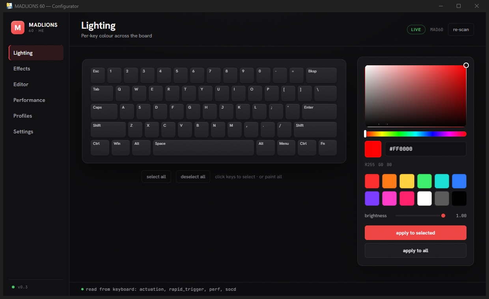

# MADLIONS 68 Configurator


A desktop app to configure the **lighting and Hall-Effect performance** of the
**MADLIONS 60% Hall Effect** keyboard — per-key RGB, animations (built-in and your own),
actuation / rapid-trigger / SOCD tuning, and profiles — as an alternative to the official web
configurator. Key remapping, Fn layers, and macros are intentionally left to the official software
(see [What it doesn't do, and why](#what-it-doesnt-do-and-why)).

It talks to the keyboard directly over USB HID (userspace — no drivers, no admin), and reads the
board's current state back so the interface reflects what's actually stored on the device.



> Not affiliated with, endorsed by, or supported by MADLIONS. Built by observing the keyboard's own
> HID protocol for interoperability; no vendor code is included. See the disclaimer at the bottom.

## Why this exists

I bought a MADLIONS 60% Hall Effect board and loved the hardware, but the stock lighting options
felt limited — a handful of canned effects and no real way to design my own or fine-tune the
Hall-Effect behaviour the way I wanted. So I reverse-engineered the keyboard's HID protocol (by
watching the traffic the official web app sends) and built a configurator that does what I actually
wanted: real per-key control, a proper animation editor, full Hall-Effect tuning, and settings that
read back from the board. It's shared here in case anyone else with the same keyboard wants the
same thing.

## Features

- **Lighting** — per-key colour with a live picker, swatches, brightness, and a guided
  **white-balance** calibrator that floods the board white and tunes R/G/B live.
- **Effects** — 15 built-in animations plus any custom ones you create.
- **Editor** — paint your own keyframe animations on a timeline: drag-to-paint, click-to-toggle,
  per-frame hold/easing with an accurate in-app preview, multi-frame select for bulk edits,
  undo/redo, and continuous autosave so unsaved work survives a crash.
- **Performance (Hall Effect)** — per-key actuation depth, rapid trigger, performance toggles
  (Swap WASD / Win-lock / Mac / NKRO / false-touch), and **SOCD / snap-tap** (e.g. A+D for
  strafing). All read back from the board when the page opens.
- **Profiles** — snapshot and restore complete looks (lighting, white balance, and more).
- **Key-mapping wizard** — the firmware's slot order is not the visual order; map it once per board.
- **Minimize to tray** — closing the window keeps animations streaming (the app keeps running in
  the system tray, like Discord or Steam); quit fully from the tray menu.

Custom animations and profiles are stored per-user under `~/.madlions/` and never leave your
machine — they are not part of the app or this repository.

## What it doesn't do, and why

**Key remapping, Fn layers, and macros are not implemented here.** This project started with one
goal — adding the custom lighting and animations the stock software lacked — and grew to cover the
Hall-Effect settings too. Remapping is a different beast: reinventing it would be a lot of fragile
work for little benefit, since the official web app already does it well.

More importantly, you don't lose anything by using both. Those bindings live in the keyboard's
**onboard flash**, and this app **never writes that region** — so a remap, Fn layer, or macro you
set in the official software stays put and coexists with the lighting and performance you set here.
Set your colours and Hall-Effect feel in this app; set your key bindings in the official web app;
they don't conflict.

**Do not run this app and the official web app at the same time.** Only one program can hold the
keyboard over USB at once. Close one before opening the other. Each reads the board's current state
when it connects, so a change you make in one shows up in the other after you switch.

## Supported hardware

Developed and verified against:

- **MADLIONS MAD60** — 60% Hall Effect keyboard, USB **VID `0x373B`, PID `0x1054`**, 61 keys
  (bottom row: Ctrl, Win, Alt, Space, Alt, Menu, Ctrl, Fn).

Everything was measured on one physical unit. A different firmware revision of the same model will
very likely work, but the per-key index maps were measured on real hardware. **Other MADLIONS
models may use a different USB ID or protocol and are not guaranteed** — see
[Reporting issues](#reporting-issues--other-models) below.

To check what you have on Windows: Device Manager → your keyboard → Properties → Details →
"Hardware Ids". If it shows `VID_373B&PID_1054`, it's the supported board.

## Install and run

**Easiest (Windows, no Python):** download `MADLIONS60.exe` from the
[Releases](../../releases) page and run it. The Edge WebView2 runtime is required; it is
preinstalled on Windows 10/11.

**From source:**

```
pip install -r requirements.txt
python main.py
```

or double-click `MADLIONS.bat` (use `MADLIONS-debug.bat` to see a console for troubleshooting).

If `hidapi` can't open the device on Windows, assign the WinUSB driver to the keyboard's
RGB/config interface with [Zadig](https://zadig.akeo.ie/).

## First-time setup

1. **Key mapping** (Settings > "run mapping wizard") — teaches the app your board's slot order so
   per-key control is correct. Saved to `~/.madlions/`.
2. **White balance** (Settings > "calibrate white") — if white looks teal or pink, tune R/G/B until
   it reads neutral. A balanced white is dimmer than full blast; that's a property of the LEDs, not
   a bug.

User data (calibration, key map, profiles, custom animations, editor autosave) lives in
`~/.madlions/`.

## How it works

- `device/` is the only layer that builds raw HID report bytes; everything else goes through it.
- Animations are rendered on the host and streamed to the board frame by frame, so they are as rich
  as the editor allows (and stop when the app is closed — hence minimize-to-tray).
- The app reads settings back from the board using the read variants of the same commands, so the
  UI shows the keyboard's real state, including changes made in the vendor software.
- It only ever sends documented configuration reports — never firmware, bootloader, or flash
  regions. Key remap / Fn-layer / macros are left to the official software
  (see [What it doesn't do, and why](#what-it-doesnt-do-and-why)).

## Reporting issues / other models

Bug reports and "please make it work on my MADLIONS" requests are welcome — open an
[issue](../../issues). Because the protocol was reverse-engineered per model, getting a different
model working usually needs a capture from that hardware. Helpful details to include:

- Your exact keyboard model and its USB `VID:PID` (see [Supported hardware](#supported-hardware)).
- What you tried and what happened (and what you expected).
- Whether the official software works on the same machine.
- For a new model: the capture tools in `tools/` (a WebHID logger + a local beacon) can record the
  protocol the official web app sends; see the comments in those files.

## Building a standalone .exe

A PyInstaller spec is included:

```
pip install pyinstaller
pyinstaller madlions.spec
```

The one-file executable is written to `dist/MADLIONS60.exe`. It bundles the web frontend, the
`hidapi` native library, the pywebview WebView2 loader, and the tray icon; the target machine still
needs the Edge WebView2 runtime (preinstalled on Windows 10/11).

## Project layout

```
device/    HID protocol + connect/read/write (the only layer that builds report bytes)
engine/    models, animation runtime, profile/animation storage, layout
ui/        web frontend (HTML/CSS/JS) served in a pywebview window
tools/     reverse-engineering capture helpers (not needed to run the app)
bridge.py  pywebview js_api: the methods the frontend calls into Python
main.py    wires it together, single-instance + tray
```

## Tech stack

Python 3.11+, `hidapi` for USB HID, `pywebview` (Edge WebView2) for the window, `pystray` + `Pillow`
for the tray icon, PyInstaller for packaging.

## Acknowledgements

Developed with the help of OpenCode Go (powered by DeepSeek V4), an open-source AI coding agent.

## License

Licensed under the **PolyForm Noncommercial License 1.0.0** — see [`LICENSE`](LICENSE). You may use,
modify, and share it for any **noncommercial** purpose (personal use, hobby projects, research,
education, and the like). Commercial use — including selling it or charging for it — is not
permitted. Keep the copyright notice in any copies.

## Disclaimer

Not affiliated with, endorsed by, or supported by MADLIONS. Provided "as is", without warranty of
any kind; the author is not liable for any damage or loss arising from its use.

This app only sends **documented configuration reports** (lighting and Hall-Effect settings) to the
keyboard. It never writes firmware, bootloader, or flash regions, so it cannot brick the device the
way a bad firmware flash could — the worst case is wrong settings, which you can change back here or
in the vendor software. Even so, use it at your own risk.
